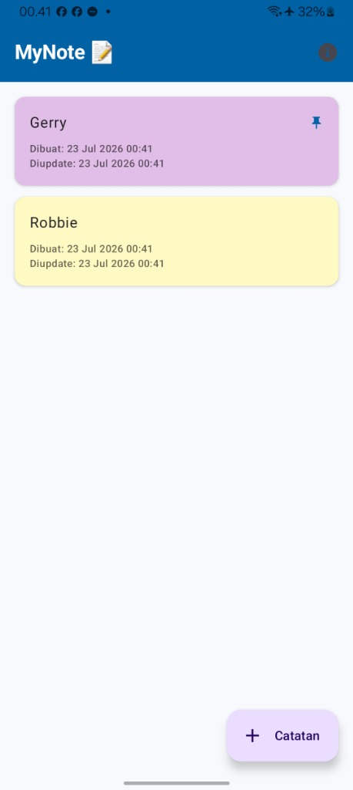
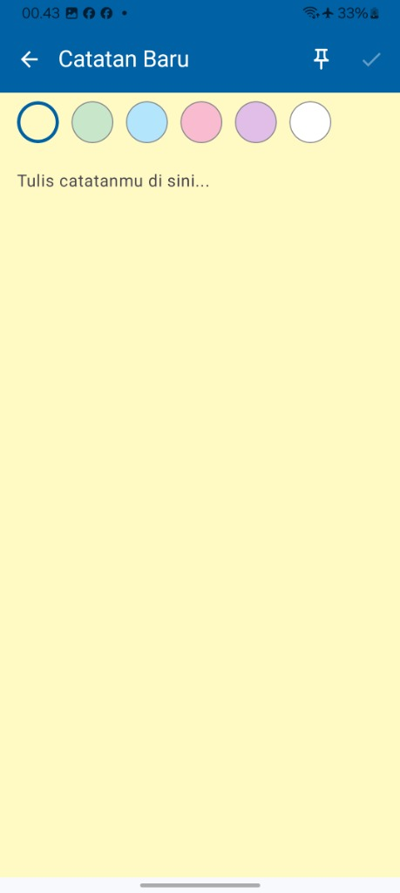
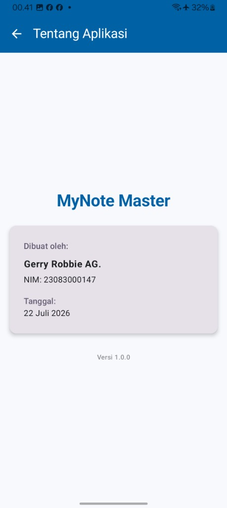

# MyNote Master - Aplikasi Catatan Modern

[](https://kotlinlang.org)
[](https://developer.android.)
[](LICENSE)

Aplikasi manajemen catatan harian (sticky notes) modern berbasis Android yang dibangun menggunakan **Jetpack Compose** untuk antarmuka deklaratif yang responsif dan berestetika tinggi. Aplikasi ini menerapkan pola arsitektur MVVM (Model-View-ViewModel) yang bersih dan penyimpanan data lokal yang andal menggunakan SharedPreferences + Gson.

---

## 🚀 Fitur Utama

Berikut adalah daftar fitur utama yang tersedia di aplikasi **MyNote Master**:

| No | Nama Fitur | Deskripsi | Screenshot |
| :---: | :--- | :--- | :---: |
| 1 | **Tampilan Home (Dashboard)** | Menampilkan daftar seluruh catatan dalam bentuk kartu berwarna. Catatan yang di-pin ditampilkan paling atas dengan ikon 📌. Terdapat tombol info (ℹ️) untuk navigasi ke halaman About dan FAB "+ Catatan" untuk menambah catatan baru. |  |
| 2 | **Tambah Catatan Baru** | Halaman editor "Catatan Baru" untuk menulis isi catatan. Dilengkapi palet warna di bagian atas untuk memilih warna latar catatan, tombol pin (📌), dan tombol simpan (✓). |  |
| 3 | **Ganti Warna Catatan** | Pengguna dapat memilih warna latar belakang catatan dari 6 pilihan warna sticky note: kuning, hijau, biru, pink, ungu, dan putih. Warna yang dipilih langsung diterapkan secara real-time. |  |
| 4 | **Sematkan Catatan (Pin)** | Fitur pin untuk menandai catatan penting agar selalu muncul di posisi paling atas daftar. Catatan yang di-pin ditandai dengan ikon 📌 di pojok kanan atas kartu. |  |
| 5 | **Halaman About** | Halaman "Tentang Aplikasi" yang menampilkan nama aplikasi **MyNote Master**, informasi pembuat (**Gerry Robbie AG.**, NIM: 23083000147), tanggal pembuatan, dan versi aplikasi. |  |

---

## 🛠️ Teknologi & Library

Aplikasi ini dibangun menggunakan tumpukan teknologi modern Android:
*   **Kotlin** - Bahasa pemrograman utama yang ekspresif dan aman.
*   **Jetpack Compose** - Toolkit modern untuk membangun UI Android secara deklaratif.
*   **Compose Navigation** - Manajemen perpindahan halaman yang clean dan type-safe.
*   **ViewModel & StateFlow** - Mengelola data UI secara reaktif agar tetap konsisten selama rotasi layar atau perubahan state.
*   **Gson & SharedPreferences** - Serialisasi objek Kotlin ke JSON untuk penyimpanan data lokal yang persisten.
*   **Material Design 3** - Panduan desain antarmuka terbaru dari Google dengan warna bertema **Modern Blue** yang premium.

---

## 📦 Cara Menjalankan Proyek (Tanpa Android Studio)

Jika Anda ingin menjalankan atau mem-build aplikasi ini langsung dari terminal (CLI) seperti yang telah dikonfigurasi pada perangkat Anda, ikuti langkah-langkah berikut:

### Prasyarat
1. Pastikan **JDK 17** terpasang dan alamat `JAVA_HOME` diarahkan dengan benar.
2. Pastikan **Android SDK** terpasang (Command Line Tools & Platform Tools).
3. Sambungkan perangkat fisik Android Anda dengan fitur **USB Debugging** aktif.

### Perintah Build & Run

1. **Jalankan kompilasi dan pasang ke HP:**
   ```powershell
   $env:JAVA_HOME="C:\Java\jdk-17.0.11+9"
   $env:ANDROID_HOME="C:\Users\TOSHIBA\AppData\Local\Android\Sdk"
   $env:PATH += ";$env:ANDROID_HOME\platform-tools"
   ./gradlew installDebug
   ```

2. **Jalankan/Launch aplikasi di layar HP:**
   ```powershell
   adb shell am start -n com.gerry.mynotemaster/.MainActivity
   ```

---

## 📂 Struktur Proyek

```text
app/src/main/java/com/gerry/mynotemaster/
├── data/
│   └── NoteStorage.kt          # Logika penyimpanan lokal JSON via SharedPreferences
├── model/
│   └── Note.kt                 # Entitas data model Catatan
├── navigation/
│   ├── MyNoteNavGraph.kt       # Struktur rute navigasi aplikasi
│   └── Screen.kt               # Rute-rute layar terdaftar
├── ui/
│   ├── screens/
│   │   ├── AboutScreen.kt      # Tampilan Tentang Aplikasi
│   │   ├── DashboardScreen.kt  # Tampilan Dashboard Utama
│   │   └── EditorScreen.kt     # Tampilan Editor Tambah/Edit Catatan
│   └── theme/
│       ├── Color.kt            # Palet warna
│       ├── Theme.kt            # Pengaturan MaterialTheme dengan Modern Blue
│       └── Type.kt             # Tipografi teks
└── MainActivity.kt             # Entry point aplikasi
```

---

## 🔗 Informasi Repository

*   **Repository URL:** [https://github.com/Gerryrag/uas-mynotemaster.git](https://github.com/Gerryrag/uas-mynotemaster.git)
*   **Package Name:** `com.gerry.mynotemaster`

---
*Dibuat dengan ❤️ oleh **Gerry Robbie AG.** (NIM: 23083000147) untuk Proyek UAS MyNote Master.*
